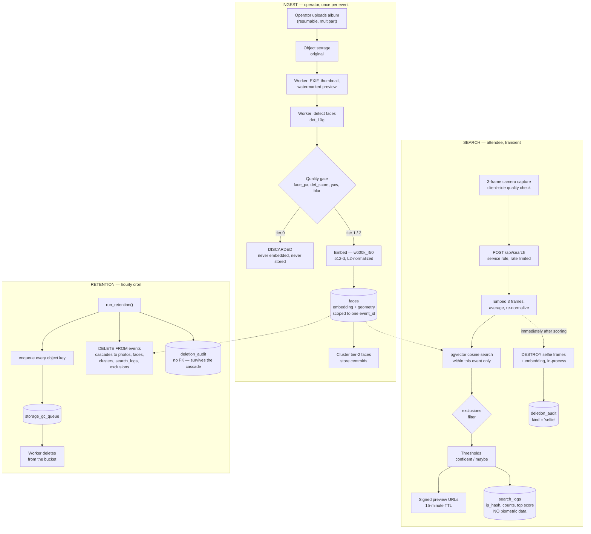

# Compliance

Face embeddings are biometric data. Under GDPR Article 9 a template computed for
the purpose of uniquely identifying a natural person is special-category
personal data, and processing it is prohibited unless one of the Article 9(2)
exemptions applies. This document records what we process, why we are allowed
to, how long we keep it, and — the part that is usually missing — which line of
code actually enforces each of those answers.

**This is engineering documentation, not legal advice.** It is written to be
handed to a lawyer so they can find the gaps quickly. §10 lists what still needs
their sign-off.

---

## 1. Roles

| Party | Role | Responsibility |
|---|---|---|
| Event organizer / photographer | **Controller** | Decides that the album exists and that face search is offered. Owes attendees notice and, where required, consent. Signs the DPA in `docs/DPA-template.md`. |
| Us | **Processor** | Processes on documented instruction from the organizer. Never determines our own purposes for the data. |
| Attendee performing a search | **Data subject**, giving explicit consent for their own selfie | Consents at the point of capture, for one search, in one event. |
| Everyone else in the album | **Data subject**, *without* having consented to us | See §2. This is the honest weak point of the model. |

## 2. The unresolved core of this business model

An attendee who submits a selfie consents for themselves. The other several
thousand people whose faces are detected and embedded during ingestion did not.
The mitigation stack below is the industry-standard answer, and it is a
mitigation, not a cure:

- The organizer, as controller, is contractually obliged to post a photography
  and biometric-processing notice at the venue and in ticket terms. `events.consent_notice_url`
  holds the evidence, so the obligation is on the record rather than in an email.
- Processing is hard-limited to matching *within a single event*, for a period
  measured in weeks. There is no identity graph, no name, and no cross-album link.
- Any person can have their vectors purged and be excluded from all future
  searches, without holding an account (§7).
- Nothing is retained past the event's `delete_after` (§5).

If a lawyer concludes that the organizer's notice is not sufficient to cover
ingestion-side processing in a particular jurisdiction, the fix is a change to
the product — for example, indexing on demand only for consenting attendees —
not a change to this document.

## 3. Data inventory

| Data | Where | Category | Why we hold it | Deleted by |
|---|---|---|---|---|
| Original photograph | Object storage (`photos.storage_bucket` / `storage_key`) | Personal data; may contain special-category by inference | The product the organizer bought | `run_retention()` → `storage_gc_queue` |
| Watermarked preview, thumbnail | Object storage | Personal data | Shown to attendees before delivery | same |
| Face embedding, 512-d | `faces.embedding` | **Special-category (Art. 9)** biometric | Matching within this event | `run_retention()` cascade |
| Face geometry: bbox, `det_score`, `face_px`, pose, blur | `faces` | Personal data | Quality gating and result ranking | same |
| Face crop | **not stored** | — | Not needed; the embedding is enough | n/a |
| Facial landmarks | **not stored** | — | Not needed for matching | n/a |
| Cluster centroid | `clusters.centroid` | **Special-category** — a centroid is still a face template | Search performance at album scale | `run_retention()` cascade |
| Attendee selfie image | **never persisted** | **Special-category** | One search | Discarded in-process; recorded by `log_selfie_deletion()` |
| Attendee selfie embedding | **never persisted** | **Special-category** | One search | as above |
| Opt-out embedding | `exclusions.embedding` | **Special-category** | *Only* to enforce the person's own opt-out | `run_retention()` cascade |
| Search audit record | `search_logs` | Pseudonymous | Abuse prevention, regulator evidence | `run_retention()` cascade |
| Salted IP hash | `search_logs.ip_hash` | Pseudonymous | Rate limiting (3/hour/event) | as above |
| Raw IP address | **never stored** | Personal data | — | n/a |
| Operator account | `auth.users` | Personal data | Contract | Account closure |
| Proof of deletion | `deletion_audit` | Metadata; no personal data beyond an event id and slug | Demonstrating Art. 5(2) accountability | Retained; see §5 |

The rows that say **not stored** and **never persisted** are as much a part of
the compliance posture as the ones that say where things live. Data we do not
hold is data we cannot leak, cannot be compelled to produce, and do not have to
defend.

## 4. Data flow



Two things in that diagram are load-bearing and easy to lose in a refactor:

- **The tier-0 branch discards before embedding.** A face too small or too
  uncertain to match is never turned into a biometric template at all. This is
  data minimisation implemented as a code path, and `faces_quality_tier_check`
  in the schema means a worker that forgets it cannot write the row anyway.
- **The selfie destruction arrow is not a scheduled job.** It happens in the
  same request, in the same process. There is no table to clean up because
  nothing was ever written to one.

## 5. Retention matrix

| Data | Retention | Enforced by |
|---|---|---|
| Attendee selfie frames + embedding | Duration of one request; target < 60s | In-process; asserted by `log_selfie_deletion(elapsed_ms)`, `within_sla` flag |
| Photos, previews, thumbnails | Until `events.delete_after` | `run_retention()` → `storage_gc_queue` → storage worker |
| Face embeddings and geometry | Until `events.delete_after` | `run_retention()`, FK cascade from `events` |
| Cluster centroids | Until `events.delete_after` | FK cascade |
| Opt-out embeddings | Until `events.delete_after` | FK cascade. The opt-out dies with the album it applied to. |
| Search logs | Until `events.delete_after` | FK cascade |
| `events.delete_after` itself | Set at event creation; **hard ceiling of 180 days** from creation | `events_retention_window` CHECK constraint |
| Deletion audit | Retained after the event. Contains an event id, a slug, counts and timestamps — no personal data about attendees. | No FK, deliberately |
| Operator account | Contract term | Manual |

The 180-day ceiling is a constraint, not a default. Contractual retention should
be 30–90 days. The ceiling exists so that no configuration path, UI bug or
well-meaning support ticket can turn an event album into permanent storage of
biometric templates.

## 6. Deletion jobs

Everything below is real code with a test behind it.

### `run_retention(p_limit int default 100)`

`supabase/migrations/20260827090200_retention.sql`

Scheduled hourly via pg_cron as `faceapp-retention`. If pg_cron is unavailable
the migration emits a notice and the job must be scheduled externally — check
this on any new environment, because a retention job that is not running fails
silently and looks exactly like one that is.

For each event past `delete_after`, in one transaction:

1. Counts the photos and faces about to be destroyed.
2. Inserts every object key it owns — original, preview, thumbnail — into
   `storage_gc_queue`. **This step is why the job is not just a `DELETE`.**
   Removing a row from Postgres does not remove a 4MB JPEG from R2 or Supabase
   Storage; without the queue, retention would delete the index and leave every
   photograph in the bucket.
3. Writes a `deletion_audit` row of kind `event_retention` recording what was
   destroyed and when.
4. `DELETE FROM events`, cascading to `photos`, `faces`, `clusters`,
   `search_logs` and `exclusions`.

`deletion_audit` has **no foreign key to `events`**. If it did, step 4 would
delete the evidence produced by step 3. Proof of deletion has to outlive its
subject. There is a test for this specific failure, and it fails if the FK is
added back.

### Storage GC worker

`ml/faceapp_worker/storage_gc.py`, container role `storage-gc`.

Claims from `storage_gc_queue` under `FOR UPDATE SKIP LOCKED` with a lease,
deletes the object through the storage driver, marks the row done. Exponential
backoff on failure, then a dead-letter state.

An object that has already gone counts as success: the object store is the
authority on whether the bytes exist, and re-running after a lease expired on a
delete that actually succeeded is the normal case, not an error.

**A dead-lettered row here is not like a dead-lettered ingest job.** That one is
a photograph that will not be searchable; this one is personal data still
sitting in a bucket after somebody was told it was gone. So the process exits
non-zero while anything is dead-lettered, and the `storage_gc_backlog` view
exposes `oldest_pending_age` — the number to alert on. A queue that is draining
has a backlog measured in minutes; one measured in days means the worker is not
running, and nobody discovers that from a queue depth that looks like any other
number.

Verified end to end, not only in SQL: a seeded album with 30 objects on disk,
expired and put through `run_retention()`, leaves the database empty and all 30
files present — then the GC worker removes every one, and the `deletion_audit`
row survives both.

### `log_selfie_deletion(event_id, elapsed_ms, frames, purpose)`

Called by `/api/search` after the selfie frames and their template have been
dropped. Records elapsed time and a `within_sla` boolean against the 60s target.
This is what turns "we delete your selfie immediately" from a marketing claim
into something a regulator can audit.

Observed on the reference implementation: **1.5–1.6 seconds** from receipt to
destruction, well inside the target. The frames arrive in a request body, become
one 512-d vector in the Python service, and are gone when the response returns.
There is no selfie table to clean up because nothing is ever written to one — the
`/enroll` endpoint touches no database and no disk.

### Verification

```bash
./supabase/tests/run.sh
```

Asserts that an expired event and everything hanging off it is destroyed, that a
live event is untouched, that all seven object keys reach the GC queue, that the
audit row survives, and that a second run is a no-op.

## 7. Data subject rights

| Right | How |
|---|---|
| **Object / opt out** (Art. 21) | Public per-event opt-out at `/e/<slug>/opt-out`. The person captures a selfie, we embed it, delete every matching face vector in that album, and store the embedding in `exclusions` so every future search subtracts them. No account, and no proof of identity — asking for identification would defeat the point, since the person asking to be out of a face database is exactly the one who should not have to hand over more identity to get out of it. **Implemented.** |
| **Erasure** (Art. 17) | The opt-out flow, plus automatic erasure of everything at `delete_after`. |
| **Access** (Art. 15) | Directed to the organizer as controller; we assist as processor. We can state what was held, but note that we cannot enumerate "photos of person X" without the person supplying a selfie — which is the correct property, not a gap. |
| **Withdraw consent** (Art. 7(3)) | A search consent covers one search and expires with it. Nothing to withdraw afterward, because nothing is kept. |

The opt-out registry is the one place we deliberately retain a biometric
template for a person who has told us not to process them. Retaining it is the
only way to *enforce* the opt-out — the alternative is purging their vectors and
then re-indexing them the next time the album is reprocessed. That reasoning
belongs in the privacy notice, in plain words, because on its face it looks like
the opposite of respecting the request. It is scoped to one event, unreadable by
the operator (there is no RLS policy granting it), and dies with the album.

## 8. Jurisdictions

The allow-list is a table, `jurisdictions`, and a trigger,
`assert_jurisdiction_allowed()`, refuses an event in a blocked one at the
database. It is not a form validator, because form validators get bypassed by
the next admin script somebody writes.

| Code | Status | Reason |
|---|---|---|
| `IL` Israel | Allowed | Primary market. Privacy Protection Law; see §10. |
| EU member states | Allowed | GDPR, processor role, signed DPA, EU hosting. |
| `US-IL` Illinois | **Blocked** | BIPA: private right of action, statutory damages per violation, nine-figure settlements. |
| `US-TX` Texas | **Blocked** | CUBI: Attorney General enforcement. |
| `US-WA` Washington | **Blocked** | State biometric statute and My Health My Data Act. |
| `US` other | **Blocked** | No US events until counsel has reviewed a per-state gate. |
| `GB` United Kingdom | **Blocked** | UK GDPR; unblock once the transfer position is documented. |

Adding a row with `allowed = true` is a legal decision, not a code change.
It should require the same sign-off as signing a contract.

## 9. Hosting and sub-processors

- **Database and storage:** Supabase, EU region for EU events. Israel-hosted or
  EU-hosted for Israeli events. Choose the region at project creation; it cannot
  be changed later.
- **ML worker:** our own container, EU region. Model inference happens on
  infrastructure we control. No image and no embedding is sent to a third-party
  face-recognition API — this is a large part of why InsightFace was chosen over
  Rekognition, and it should stay that way.
- **Object storage at scale:** Cloudflare R2, EU jurisdiction restriction set.
- **Delivery:** Twilio for WhatsApp. Receives a phone number and a link, never a
  photograph or an embedding.
- **Hosting for the web app:** Vercel.

Every one of these is a sub-processor and belongs in the DPA annex.

## 10. Open items for counsel

1. **Israel.** Whether the database must be registered under the Privacy
   Protection Law, and whether the DPO threshold is met. Recent amendments
   materially increased the regulator's enforcement powers and administrative
   fines. Budget two hours with a local privacy lawyer before the first paid event.
2. **Article 9 basis for non-consenting attendees.** §2. The single most
   important question in this document.
3. **DPIA.** Large-scale processing of biometric data using new technology is
   close to a textbook trigger for Article 35. Assume one is required.
4. **Minors.** The schema blocks a youth-flagged event from becoming searchable
   without an organizer attestation. Counsel should specify what that attestation
   must actually say.
5. **The 180-day ceiling** and the 30–90 day contractual default.
6. **Whether a false positive is a notifiable breach.** Our working assumption is
   yes: returning photographs of a stranger to someone is an unauthorised
   disclosure of personal data. That assumption is why `T_high` is set at
   precision ≥ 0.99 rather than at the F1 optimum, and it is worth confirming
   before we tune anything.

## 10a. Implementation status

What the code does today, so this document can be checked against it rather than
believed:

| Control | State |
|---|---|
| Jurisdiction gate (IL/TX/WA refused) | Database trigger. Enforced, tested. |
| Retention deletes the event and cascades | `run_retention()`. Enforced, tested. |
| Object storage actually emptied | Implemented and verified end to end. §6. |
| Selfie destroyed within 60s, audited | Implemented; measured at ~1.5s. |
| Opt-out purges vectors and blocks future search | Implemented. |
| Operator isolation | RLS, exercised by the app itself via `SET LOCAL request.jwt.claims`. |
| Opt-out embeddings unreadable by operators | RLS on, no policy, no grant. |
| Tier-0 faces never embedded | Enforced in the pipeline and by a CHECK constraint. |
| Gender/age inference | Model deliberately not loaded. |
| Watermarked previews and thumbnails | Implemented. |
| Signed URLs with short expiry | Implemented, 15 minutes. |
| Precision >= 0.99 before results are trusted | **Enforced by refusing to run.** No album has been evaluated. |
| Youth events need an attestation | CHECK constraint plus a second check in the search route. |

## 11. Incident posture

The characteristic incident for this product is not a database breach. It is a
**false positive**: a search returns a photograph of someone other than the
person who searched. That is an unauthorised disclosure of personal data to a
third party, and it happens one attendee at a time, quietly, without anything in
the logs looking wrong.

This is why:

- `T_high` is chosen at precision ≥ 0.99 on a labeled evaluation set, and never
  hardcoded — `ml/config/thresholds.toml` is only writable by the eval harness,
  and the loader raises rather than guessing a default.
- The "maybe" bucket is never auto-included in a download and never auto-sent
  over WhatsApp. A borderline match has to be looked at by the person before it
  goes anywhere.
- `search_logs.top_score` and the returned counts are recorded, so a
  distribution shift after a model change is visible before it becomes a report.
